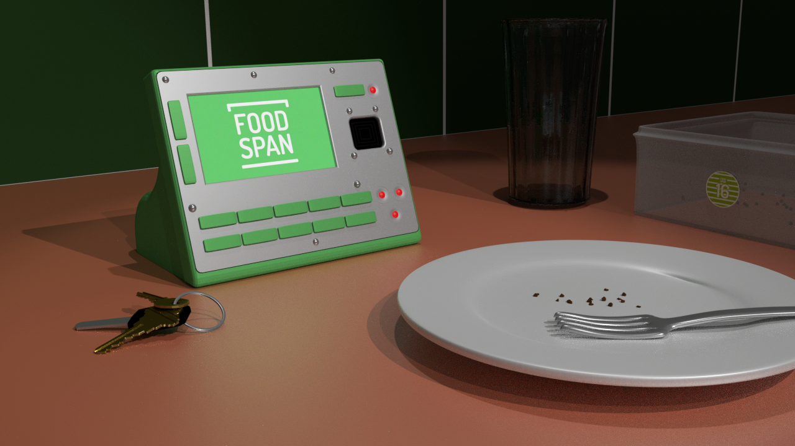
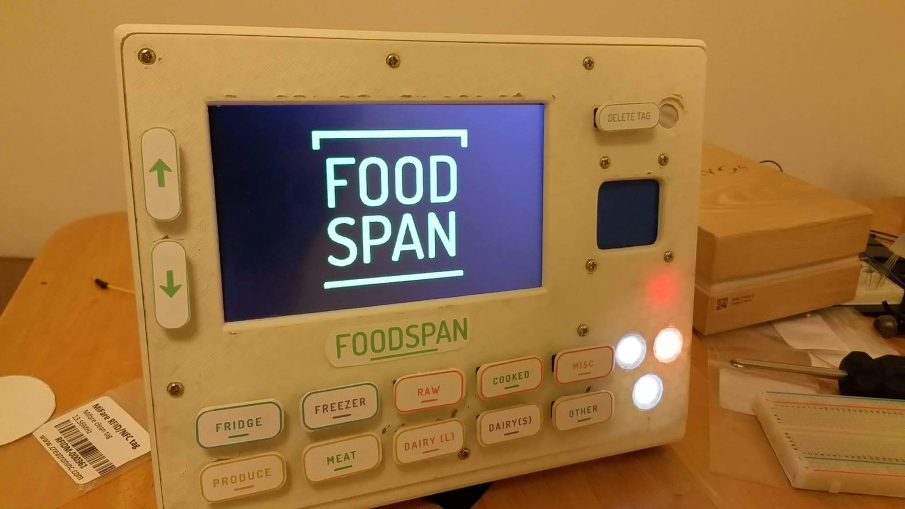

# FOODSPAN Display Code

This is the code for the entire console for FoodSpan.

This includes code for the buttons, display, NFC tagging system, LED error lights and wifi shield.

Please note : 

In the display.io file the images were converted to a byte array which is an unsigned long long []. Unfortunately, Arduino does not support unsigned long long so I had to re-write some of the directories. 

Special Thanks to Melvin Wang our CEO :)

For more information about our product please visit : www.foodspan.ca

